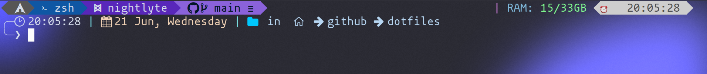
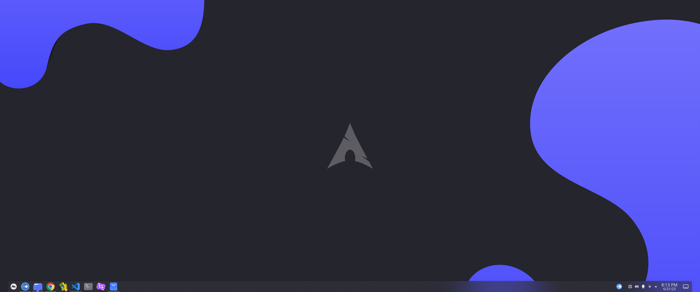
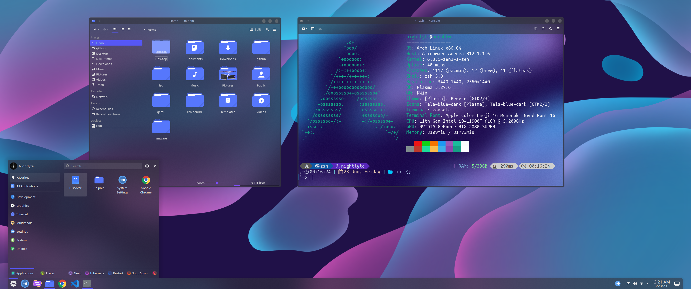

# ***Nightlyte🌙 dotfiles*** 
My custom themes/dotfiles :)
<br></br>

# **Wallpaper**
## **Nightlyte Blobs🫧** - [***Available now on the Wallpaper Engine Steam Workshop!***](https://steamcommunity.com/sharedfiles/filedetails/?id=2996073544 "Nightlyte Blobs - Steam Workshop Page")
### *Details:*


‎ ‎ <ins>Mood</ins>
- [x] *Relaxing* 💤

‎ ‎ <ins>Aesthetic</ins> 
- [x] *Pleasing* ✨

‎ ‎ <ins>Blobs</ins>
- [x] *Blobbing* *🫧*
<br></br>

[**Subscribe, Favorite, and Share!**](https://steamcommunity.com/sharedfiles/filedetails/?id=2996073544 "Nightlyte Blobs - Steam Workshop Page") <br><sub> [- Get Wallpaper Engine](https://store.steampowered.com/app/431960/Wallpaper_Engine/ "Wallpaper Engine Steam Page") (if you don't have it)</sub></br>

> *Nightlyte*🌙


## **PNG File 🗎**
> ### [nightlyte-blobs.png](images/nightlyte-blobs.png)
> 
<!-- >>  -->


# **Linux**

## **Shell** 

### [Zsh](https://github.com/ohmyzsh/ohmyzsh/wiki/Installing-ZSH)
  * [Oh My Zsh](https://ohmyz.sh/)
    - *Plugins*: `copypath git sudo zsh-autosuggestions zsh-syntax-highlighting`
  * [Oh My Posh](https://ohmyposh.dev/)
    - *Theme*: `nightlyte-kush.omp.json`
  * Font
    - Mononoki Nerd Font
      - 16pt


## **Themes**
### *KDE Plasma*



### ***Theme*** 
* [LayanDark](https://github.com/vinceliuice/Layan-gtk-theme) (Enabled w/ Kvantum Manager)

### ***Icons***
 * [Tela Blue Dark](https://github.com/vinceliuice/Tela-icon-theme)

### ***Cursors***
 * [Bibata Modern Classic](https://www.gnome-look.org/p/1914825)

### ***SDDM Login Theme***
 * [Sugar Candy](https://store.kde.org/p/1312658/)


<!-- # Helpful Commands
<details>
  <summary> 
    <b> Installing multiple fonts zips at once </b>
  </summary>

  ```bash
  # Download font zips from here - https://www.nerdfonts.com/font-downloads
  cd <your_font_zips>
  # next command extracts all TTF and OTF files into your `.fonts` folder.
  unzip "*.zip" "*.ttf" "*.otf" -d ${HOME}/.fonts
  # next command rebuilds font cache
  sudo fc-cache -f -v
  ```
  
</details>

<details>
  <summary> 
    <b> Importing/exporting gnome terminal profiles (gnome-terminal-profiles.dconf) </b>
  </summary>

  ```bash
  #Export profile to file
  dconf dump /org/gnome/terminal/legacy/profiles:/ > ~/gnome-terminal-profiles.dconf

  #Import profile from file
  dconf load /org/gnome/terminal/legacy/profiles:/ < /$LOCATION/gnome-terminal-profiles.dconf
  ```
  If you don't have dconf editor, you can install it with
  ```bash
  sudo apt-get install dconf-editor
  ```

</details> -->


